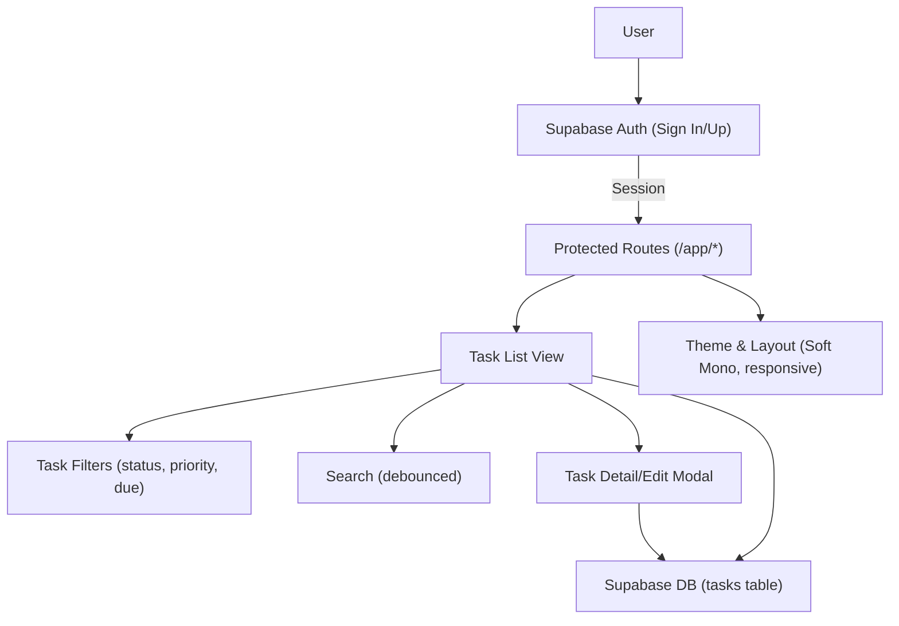

# Task Manager Frontend PRD

## Introduction

### Product Summary
The Task Manager is a web application that enables users to create, organize, and manage tasks efficiently. It supports task CRUD operations, priorities, deadlines, filtering, and a responsive interface using a minimalist “Soft Mono” design. Supabase provides authentication and data persistence. This document defines the product requirements for the React-based frontend application.

### Scope
This PRD covers the frontend application only, implemented in React and integrating with Supabase for authentication and database access. It focuses on UI/UX behavior, feature requirements, and technical constraints for the browser client.

## Target Users

### Primary Users
- Individual professionals and students who need a simple, fast way to manage personal tasks and deadlines.
- Early-stage teams seeking a lightweight shared task view (future consideration; initial release focuses on individual user tasks tied to their Supabase-authenticated account).

### Secondary Users
- QA and stakeholders evaluating functionality and usability of the app in a demo or pilot environment.

## Core Features

### 1. Authentication (Supabase)
- Sign up, Sign in, and Sign out flows using Supabase Auth (email and password).
- Session persistence: The app should remember logged-in state across refreshes using Supabase’s auth session handling.
- Error and loading states: Clear feedback for invalid credentials, network errors, and in-progress states.
- Environment variables:
  - REACT_APP_SUPABASE_URL
  - REACT_APP_SUPABASE_KEY

### 2. Task CRUD
- Create: Users can add new tasks with title (required), optional description, priority, due date, and status.
- Read: List of tasks for the authenticated user; task detail view (inline or modal) for expanded information.
- Update: Edit task properties including title, description, priority, due date, and status (e.g., To Do, In Progress, Done).
- Delete: Remove a task with a confirmation prompt to prevent accidental deletion.
- Data model (frontend expectations aligned with Supabase table “tasks”):
  - id: string/uuid (from backend)
  - user_id: string/uuid (owner, from auth)
  - title: string (required, 1–120 chars)
  - description: string (optional, up to 2000 chars)
  - priority: enum { low, medium, high }
  - status: enum { todo, in_progress, done }
  - due_date: date or timestamp (nullable)
  - created_at: timestamp
  - updated_at: timestamp

### 3. Priorities and Deadlines
- Priority selection in task form with visual indication (subtle color accents per Soft Mono palette).
- Due date picker with clear formatting (e.g., YYYY-MM-DD). Overdue tasks should be visually indicated.
- Sorting options: by due date, priority, and recently updated.

### 4. Filtering and Search
- Quick filters: status (All, To Do, In Progress, Done).
- Priority filter: All, Low, Medium, High.
- Date filter: due today, this week, overdue.
- Text search on title (and optionally description) with debounce.
- Filters are combinable and persist in URL query parameters to allow sharing/restoring state.

### 5. Responsive UI (Soft Mono Minimalist)
- Works seamlessly across mobile, tablet, and desktop.
- Layout:
  - Header: logo/app title, auth user menu (profile/sign out), optional global search.
  - Sidebar (collapsible on mobile): filters and quick actions.
  - Main panel: task list with sorting and pagination or infinite scroll; new task button; selection modes (single)
  - Modal dialogs: new/edit task, delete confirmation.
- Adhere to Soft Mono theme:
  - Colors from style guide: primary #6B7280, secondary #9CA3AF, success #10B981, error #EF4444, background #F9FAFB, surface #FFFFFF, text #111827.
  - Minimalist design: generous whitespace, clean typography, subtle elevation for surfaces, unobtrusive borders.
- Dark mode support:
  - Use CSS variables and a document-level data-theme attribute similar to the existing theme toggle pattern in src/App.js.
  - Respect prefers-color-scheme when possible; allow manual override.

## Design and User Experience Requirements

### Visual Design
- Typography: System fonts with clear hierarchy—title, section headers, list items, and meta text.
- Spacing: Consistent spacing scale; sufficient white space to avoid clutter.
- Color usage: Primarily monochrome with warm, subtle accents. Avoid saturated or distracting colors except for success and error states.
- States: Provide visible states for hover, focus, active, loading, empty lists, and error boundaries.

### Interactions
- Forms:
  - Inline validation messages under fields.
  - Disabled submit buttons during mutation; spinner or progress indicator.
- Task list:
  - Each item shows title, priority badge, due date (if set), and status.
  - Overdue tasks show a subtle left border or icon hint and accessible text.
  - Click to open detail/edit modal.
- Accessibility:
  - Keyboard navigable throughout: tab order, Enter/Escape behavior in modals, focus traps.
  - ARIA labels for interactive controls; semantic HTML for lists and sections.
  - Sufficient color contrast for text and icons.

### Performance
- Snappy feel on low-end devices:
  - List virtualization not required initially but keep DOM light.
  - Debounced search; avoid unnecessary re-renders.
- Loading placeholders for task list and modals.

### Empty and Error States
- Empty task list: Friendly message and a primary action to create the first task.
- Network or auth errors: Clear messaging with retry actions.

## Information Architecture

### Navigation
- Auth routes:
  - /auth/signin
  - /auth/signup
- App routes (protected):
  - /app/tasks
  - /app/tasks/:id (optional deep link to open detail modal)
- Query params for filters:
  - ?status=todo|in_progress|done
  - &priority=low|medium|high
  - &due=overdue|today|week
  - &q=searchTerm
  - &sort=due_date|priority|updated_at

### Components (Frontend)
- Auth components: SignIn, SignUp, AuthGuard (route protection).
- Task components: TaskList, TaskListItem, TaskFilters, TaskFormModal, DeleteConfirmModal.
- Layout components: Header, Sidebar, Main, ThemeToggle.

## Technical Stack

### Framework and Libraries
- React 18 (already in use).
- Supabase JS client for auth and data access.
- React Router for client-side routing (if not present, will be added during implementation).
- Date utility for formatting (e.g., date-fns) if needed; keep minimal.
- Testing: React Testing Library and Jest (already present).

### Project Structure (Proposed)
- src/
  - auth/ (Supabase client, hooks, auth components)
  - components/ (reusable UI components)
  - features/tasks/ (task-specific components, hooks, services)
  - layouts/
  - routes/
  - styles/ (CSS variables, theme tokens)
  - app/ (App root, providers)
- Styling:
  - CSS Modules or scoped CSS with a central variables file using CSS custom properties aligned to the Soft Mono palette.
  - Support for [data-theme="dark"] toggling.

### State Management
- Local component state and hooks.
- Minimal global state using context providers for auth session and theme.
- URL state for filters and sorting.

### API Integration
- Supabase:
  - Auth: signIn, signUp, signOut, session handling.
  - Database: use Supabase client to read/write tasks with row-level security (RLS) ensuring user_id scoping.
- Error handling centralized in a small utility/hook.

## Security and Privacy

### Authentication and Authorization
- All task reads/writes are scoped to the authenticated user.
- Frontend never stores Supabase service role keys; uses only REACT_APP_SUPABASE_KEY for anon public access as configured in Supabase.

### Data Handling
- Do not log sensitive information.
- Respect browser storage for minimal session handling through Supabase client.

## Assumptions

- A Supabase project exists with:
  - Auth enabled for email/password.
  - A “tasks” table with columns: id (uuid), user_id (uuid), title (text), description (text), priority (text or enum), status (text or enum), due_date (date/timestamp), created_at, updated_at.
  - RLS policies restricting access to the owner’s rows.
- The frontend will use the public anon key via REACT_APP_SUPABASE_KEY.
- Backend endpoints beyond Supabase are not required for MVP.

## Out of Scope

- Team workspaces, task sharing/collaboration, and role-based permissions.
- Subtasks, attachments, comments, or activity history.
- Push notifications, email reminders.
- Kanban or calendar views (beyond basic due date listing).
- Offline-first or extensive caching strategies.
- Internationalization (i18n).

## Non-Functional Requirements

### Reliability
- The UI must handle Supabase downtime gracefully with retry prompts and non-blocking error UI.

### Maintainability
- Component-based architecture with clear separation between UI, hooks, and data services.
- ESLint rules applied; consistent code style.

### Observability
- Minimal client-side logging for error boundaries (non-sensitive).

## Release Plan

### MVP
- Supabase authentication flows.
- Task CRUD with priorities and due dates.
- Filtering, sorting, and basic search.
- Responsive Soft Mono UI with dark mode toggle.
- Protected routes.

### Future Enhancements
- Multi-user collaboration.
- Calendar and Kanban views.
- Reminders/notifications.
- Bulk actions and drag-and-drop ordering.

## Environment and Configuration

### Required ENV Variables
- REACT_APP_SUPABASE_URL
- REACT_APP_SUPABASE_KEY

### Build and Run
- Development: npm start (React Scripts).
- Testing: npm test.
- Production: npm run build.

## Appendix

### Design Tokens (Soft Mono)
- primary: #6B7280
- secondary: #9CA3AF
- success: #10B981
- error: #EF4444
- background: #F9FAFB
- surface: #FFFFFF
- text: #111827
- gradient: from-gray-50 to-gray-200

### References
- Current codebase uses a theme toggle approach with data-theme attribute (see src/App.js).
- The project currently includes React Scripts, React Testing Library, and basic CSS structure.

## Changelog
- v0.1 Initial PRD draft for Task Manager Frontend.
